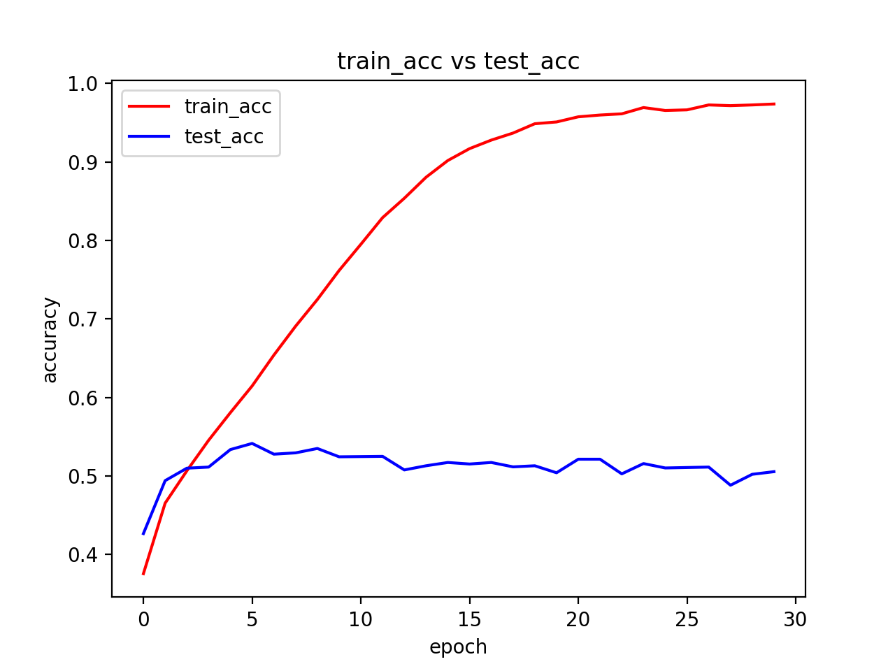
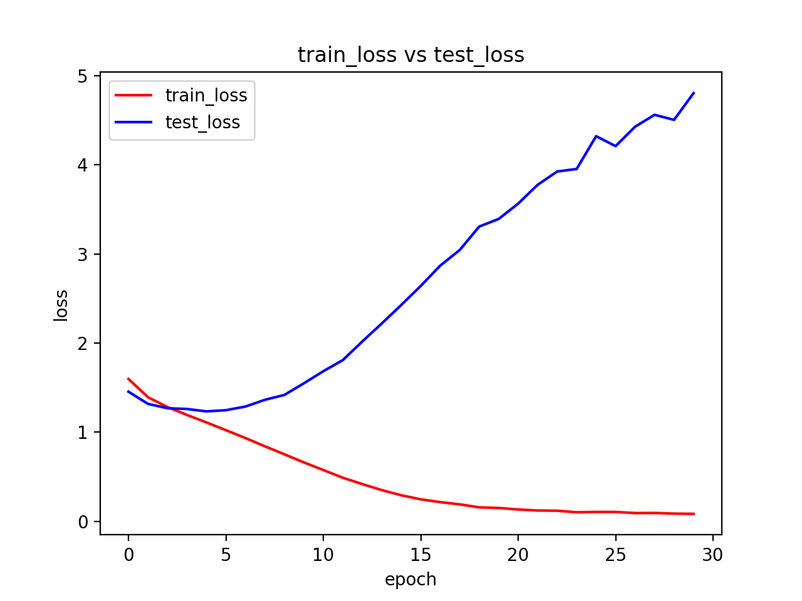

# Takeout 1 - Facial-Expression/Emotion Recognition
## Description
The project aims to recognise Facial Expressions or Emotions using Machine Learning.
The process involves 4 major steps - 
1. Data Preprocessing
2. Building the CNN Model
3. Training the CNN on the Training set and Evaluating it on the Test set
4. Visualization

## Dataset
We are using the fer2013 dataset available here https://drive.google.com/file/d/1hNsxC6js62sL_CKVr4yNIFnhzLbGQIh6/view?usp=sharing or can be downloaded through the Dataset.zip file present in the repository. 

## Requirements
* Python 3.5 or above
* Tensorflow 1.6
* Keras 2.3.1
* OpenCV
* scikit-learn
* Numpy
* pandas
* Matplotlib
* seaborn

## Dataset Cleaning
Install the required libraries, edit the CSV file path according to your system file path and run the Segration.py file.\
This program focuses on cleaning the fer2013 CSV file by removing rendundant data and segregating the emotions into 7 emotion categories :
'Angry', 'Disgust', 'Fear', 'Happy', 'Sad', 'Surprise', 'Neutral'
```python
python Segregation.py
```
## The CNN Model
Install the required libraries, edit the CSV file path according to your system file path and run the Model.py file.\
Training takes a while to complete, but it can be sped up by using GPU options.
```python
python Model.py
```
## Results
* acc: 0.9757
* loss: 0.0793 
* val_loss: 4.1867 
* val_acc: 0.5103



